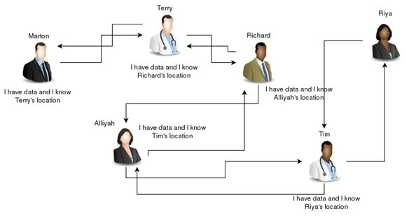
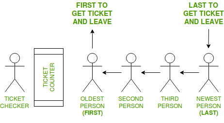
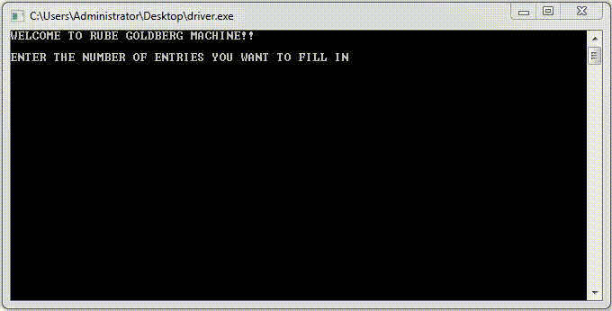

# Rube Goldberg Machine
This is an attempt to build a virtual ***Rube Goldberg machine*** to practice with some of the data structures (Linked Lists, Queues, Stacks, and Trees).

## What is a Rube Goldberg Machine?
A Rube Goldberg Machine is a complex device that performs simple tasks in indirect and convoluted ways Reuben Goldberg was an American engineer who changed his career to cartoonist. He was famous for his political cartoons and satire. However, the works which would lead to his lasting fame involved a character named Professor Lucifer Gorgonzola Butts shown in the following cartoon. 
 

 In this series, Goldberg drew absurd inventions that would later bear his name: Rube Goldberg Machines. Rube Goldberg received the Pulitzer prize for his satire in 1948. Today there are several contests around the world known as Rube Goldberg contests, which challenge high school students to make complex machines to perform a simple tasks.  These contests are not only fun, but they challenge students to practice fundamental engineering, physics, and mechanical principles as well as encourage creativity. They must utilize a specified number of various simple machines, using common junk and household items to perform absurdly simple tasks such as cracking open and egg, opening a door, ringing a bell, and so forth.

 

## Description
Creating a virtual Rube Goldberg Machine with ADTs. The ADTs used includes the queue, stack, binary tree, heap, and many of the associated operations on these ADTs. One way to approach the problem is to think about the functionality from the user’s perspective. This is a reasonable place to start, however we should think in terms of the application being composed of ADTs and operations upon them. The ADTs will contain the data and with each ADT, there are lots of operations upon them.
 

   

 

## Data-Structures with Real-Life Examples

### Linked List
A linked list is a linear data structure, in which the elements are not stored at  contiguous memory locations. The elements in a linked list are linked using pointers. In simple words, a linked list consists of nodes where each node contains a data field and a reference(link) to the next node in the list.

 

### Queue
 A Queue is a linear structure which follows a particular order in which the operations are performed. The order is First In First Out (FIFO). A good example of a queue is any queue of consumers for a resource where the consumer that came first is served first. In a queue, we remove the item that is least recently added.

 

### Stack
Stack is a linear data structure which follows a particular order in which  the operations are performed. The order may be LIFO(Last In First Out) or FILO(First In Last Out). There are many real-life examples of a stack. Consider an example of plates stacked over one another in the canteen. The plate which is at the top is the first one to be removed, i.e. the plate which has been placed at the bottommost position remains in the stack for the longest period of time. So, it can be simply seen to follow LIFO(Last In First Out)/FILO(First In Last Out) order.

 

### Tree
 A Tree is a recursive data structure containing the set of one or more data nodes where one node is designated as the root of the tree while the remaining nodes are called as the children of the root. The nodes other than the root node are partitioned into the non empty sets where each one of them is to be called sub-tree. Nodes of a tree either maintain a parent-child relationship between them or they are sister nodes.

 

## Working of the Virtual Rube Goldberg

- [x] Read from a provided text file list of data in the following format:
  - first name (30 characters)
  - last name (30 characters)
  - age 
  - day of birth (mm-dd-yy)
- [x] Support any number of entries. As the data is read from a file, initially store the data in a queue. 
- [x] Dequeue each element from the queue, print each item, and requeue each item. The user can press any key to continue the processing. 
- [x] Reverse the order of the data in the queue by dequeuing each element and pushing them onto a stack. Once all the data is dequeued from the queue and pushed on to the stack, pop off each element of the stack and re-queue each element back into a queue ADT, reversing their order in the queue. Once completed, dequeue each element from the queue and print each item for the user. Requeue to preserve the order.
- [x] Dequeue the elements from the queue and place them into an unordered binary tree. Add the items into the tree ADT in the order they are dequeued, adhering to the binary tree shape property.
- [x] Print the contents of the tree in pre-order and ask the user to press any key to continue the processing. Print the contents of the tree in post-order and ask the user to press any key to continue the processing. Ask the user to press any key to continue the processing.
- [x] Move the data from the unordered binary tree into a linked list ADT using an in-order traversal of the tree. Print the contents of the list and ask the user to press any key to continue the processing.
- [x] Sort the contents of the list using a quick sort in ascending order. Print the contents of the list and ask the user to press any key to continue the processing.
- [x] Allow the user to interactively enter another name, age, and birthday. Add this to the list in the proper location to maintain the sorted order. Print the contents of the list and the user can press any key to continue the processing.

## Data Structures Used

### 1)	BINARY SEARCH TREES

Unlike linear data structures (Array, Linked List, Queues, Stacks, etc) which have only one logical way to traverse them, trees can be traversed in different ways. Following are the generally used ways for traversing trees.

**Inorder Traversal:**
In case of binary search trees (BST), Inorder traversal gives nodes in non-decreasing order. To get nodes of BST in non-increasing order, a variation of Inorder traversal where Inorder traversal reversed can be used.

**Preorder Traversal:**
Preorder traversal is used to create a copy of the tree. Preorder traversal is also used to get prefix expression on of an expression tree

**Postorder Traversal:**
Postorder traversal is used to delete the tree. Postorder traversal is also useful to get the postfix expression of an expression tree.

**Insertion of a key:**
A new key is always inserted at the leaf. We start searching a key from the root until we hit a leaf node. Once a leaf node is found, the new node is added as a child of the leaf node. 

**Time Complexity:** The worst-case time complexity insert operation is O(h) where h is the height of the Binary Search Tree. In the worst case, we may have to travel from root to the deepest leaf node. The height of a skewed tree may become n and the time complexity of insert operation may become O(n).

**Time Complexity for traversals: O(n)**  
Complexity function T(n) — for all problem where tree traversal is involved — can be defined as: 
T(n) = T(k) + T(n – k – 1) + c  
Where k is the number of nodes on one side of root and n-k-1 on the other side.  
Let’s do an analysis of boundary conditions  
**Case 1 :** Skewed tree (One of the subtrees is empty and other subtree is non-empty)  
k is 0 in this case.  
T(n) = T(0) + T(n-1) + c  
T(n) = 2T(0) + T(n-2) + 2c  
T(n) = 3T(0) + T(n-3) + 3c  
T(n) = 4T(0) + T(n-4) + 4c  

T(n) = (n-1)T(0) + T(1) + (n-1)c  
T(n) = nT(0) + (n)c  
Value of T(0) will be some constant say d. (traversing a empty tree will take some constants time)  
T(n) = n(c+d)  
T(n) = Θ(n) (Theta of n)   

**Case 2 :** Both left and right subtrees have equal number of nodes.  
T(n) = 2T(|_n/2_|) + c   

**Auxiliary Space :** If we don’t consider size of stack for function calls then O(1) otherwise O(n).  

### 2)	QUEUE

Queues are a type of container adaptors which operate in a first in first out (FIFO) type of arrangement. Elements are inserted at the back (end) and are deleted from the front.
 The functions supported by queue are : 
1.	isQueueEmpty() – Returns whether the queue is empty.
2.	enqueue() – This operation adds a new node after rear and moves rear to the next node.
3.	dequeue():This operation removes the front node and moves front to the next node.
4.	displayQueue(): Displays Queue Data

**Time Complexity:** Time complexity of both operations enqueue() and dequeue() is O(1) as we only change few pointers in both operations. There is no loop in any of the operations.

### 3)  STACK

Stacks are a type of container adaptors with LIFO(Last In First Out) type of working, where a new element is added at one end and (top) an element is removed from that end only.
 
The functions associated with stack are:
isStackempty() – Returns whether the stack is empty – **Time Complexity :** O(1)  
emptyStack() – Empties the stack till no element is left– **Time Complexity :** O(1)  
displayStack() – Display all the Stack Data – **Time Complexity :** O(1)  
push(g) – Adds the element ‘g’ at the top of the stack – **Time Complexity :** O(1)  
pop() – Deletes the top most element of the stack – **Time Complexity :** O(1)

### 4)  LINKED LIST

A linked list is a linear data structure, in which the elements are not stored at contiguous memory locations. 
In partition(), we consider last element as pivot. We traverse through the current list and if a node has value greater than pivot, we move it after tail. If the node has smaller value, we keep it at its current position.
In QuickSortRecur(), we first call partition() which places pivot at correct position and returns pivot. After pivot is placed at correct position, we find tail node of left side (list before pivot) and recur for left list. Finally, we recur for right list.

**Time Complexity:**  Linked list nodes may not be adjacent in memory. in linked list, we can insert items in the middle in O(1) extra space and O(1) time if we are given reference/pointer to the previous node. Therefore merge operation of merge sort can be implemented without extra space for linked lists. Quick Sort requires a lot of this kind of access. In linked list to access i’th index, we have to travel each and every node from the head to i’th node as we don’t have continuous block of memory. Therefore, the overhead increases for quick sort.

## Steps for usage
- Cloning the Repository: 

        git clone https://github.com/srijarkoroy/RubeGoldberg.git
- Entering The directory: 

        cd RubeGoldberg
- Compiling the program:

        gcc driver.cpp -o application.exe
- Running the file:
        
        application.exe
- Stopping from the terminal:

        Ctrl+C

## Demonstration:

## Contributors:

- <a href = "https://github.com/am9964">Ankit Mathur</a>
- <a href = "https://github.com/indiradutta">Indira Dutta</a>
- <a href = "https://github.com/srijarkoroy">Srijarko Roy</a>
- <a href = "https://github.com/AdarshSrivastava63">Adarsh Srivastava</a>
