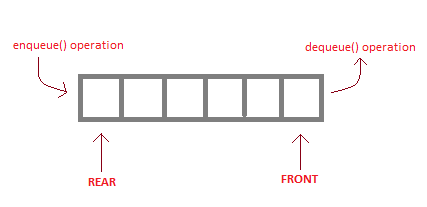
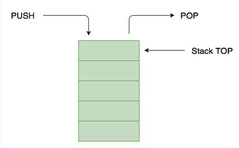
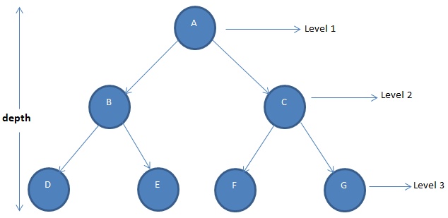
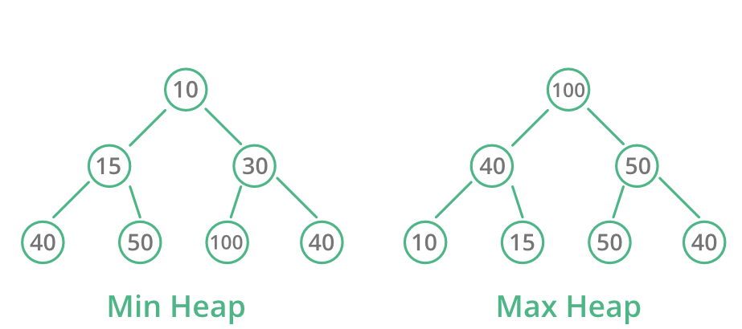

# Rube Goldberg Machine

## What is a Rube Goldberg Machine?
This is an attempt to build a virtual Rube Goldberg machine to practice with some of the data structures (Linked Lists, Queues, Stacks, and Trees). A Rube Goldberg Machine is a complex device that performs simple tasks in indirect and convoluted ways Reuben Goldberg was an American engineer who changed his career to cartoonist. He was famous for his political cartoons and satire. However, the works which would lead to his lasting fame involved a character named Professor Lucifer Gorgonzola Butts shown in the following cartoon. 
 

 In this series, Goldberg drew absurd inventions that would later bear his name: Rube Goldberg Machines. Rube Goldberg received the Pulitzer prize for his satire in 1948. Today there are several contests around the world known as Rube Goldberg contests, which challenge high school students to make complex machines to perform a simple tasks.  These contests are not only fun, but they challenge students to practice fundamental engineering, physics, and mechanical principles as well as encourage creativity. They must utilize a specified number of various simple machines, using common junk and household items to perform absurdly simple tasks such as cracking open and egg, opening a door, ringing a bell, and so forth.

 

## Description
Creating a virtual Rube Goldberg Machine with ADTs. The ADTs used includes the queue, stack, binary tree, heap, and many of the associated operations on these ADTs. One way to approach the problem is to think about the functionality from the user’s perspective. This is a reasonable place to start, however we should think in terms of the application being composed of ADTs and operations upon them. The ADTs will contain the data and with each ADT, there are lots of operations upon them.
 

   
